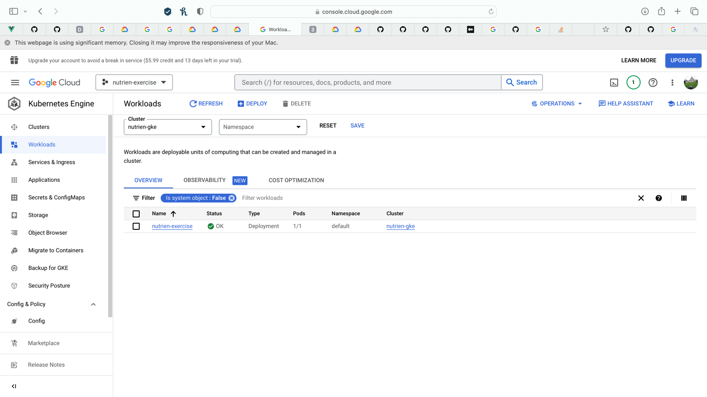

<!-- Nutrien Exercise -->
## Nutrien Exercise

#### This repo contains a set of templates for the Nutrien exercise. Based on the instructions received.

### Introduction
#### 1. The project contains a set of template folder structure that is typically used in an enterprise project with different naming conventions.
#### 2. The idea of segregating the flow of extracting data into subfolders is to show the other additional functionality we can incorporate.
#### 3. The project also contains Dockerfile. This is to show how we can containerize the application and run it in a container.
#### 4. The project also contains a set of unit tests to show how we can test the application and use it in CI/CD pipeline.

### Steps
#### 1. Clone the project and run npm install to install all the dependencies.

```
npm install
```
#### 2. In order to run tests, use npm test. This will use the jest config and run tests. The configuration to run the tests in CI/CD pipeline is also added incase of pull-requests.
```
npm test
```
#### 3. The project is automated using Github Actions to perform a GKE deployment on GCP. The deployment.yaml and service.yaml specify the initial image tags.

#### 4. The deployment workflow is triggered on workflow-dispatch instruction. In this case, just for example, I have included the tag as input parameter. This can be configured to use tag/environment or other variables.

### Exercise output

#### 1. The project is deployed on GKE cluster on GCP.



#### 2. The deployed pod can be accessed using the load balancers ip address

```
http://34.138.109.184:8081/
```

#### 3. The output displayed in the browser contains the most frequently used words and the number in brackets show the count.

```

Example: ["I(1649)","him(881)","so(779)","(621)","whale(590)","now(537)"]

```